<!--
╔══════════════════════════════════════════════════════════════╗
║  ANGEL — DEVELOPER PROFILE                                  ║
║  GitHub: Aglp-ds                                            ║
╚══════════════════════════════════════════════════════════════╝
-->

<div align="center">



<br/>


</div>

---

<table>
<tr>
<td width="58%" valign="top">

## `> whoami`

```yaml
name: Angel
username: Aglp-ds
location: Guatemala

role:
  - Software Developer
  - Systems Engineering Student

aliases:
  - Wareje
  - Winds

focus:
  - Full-stack development
  - Backend architecture
  - Database design
  - AI-powered workflows

status: "Building the next version..."
```

</td>
<td width="42%" valign="top">

## `> current_mission`

Desarrollo sistemas web, APIs y herramientas que transforman procesos complejos en soluciones claras y funcionales.

```text
[01] Diseñar
[02] Construir
[03] Automatizar
[04] Mejorar
```

> Primero debe funcionar. Después debe ser claro. Finalmente, debe poder crecer.

</td>
</tr>
</table>

---

## `> tech_stack --status active`

<div align="center">

### Lenguajes


### Frameworks, bases de datos y herramientas


</div>

---

## `> featured_projects --limit 3`

<table>
<tr>
<td width="33%" align="center" valign="top">

### 📁 Proyecto 1

`ESPACIO RESERVADO`

Proyecto en preparación.

<a href="https://github.com/Aglp-ds">
  
</a>

</td>
<td width="33%" align="center" valign="top">

### 📁 Proyecto 2

`ESPACIO RESERVADO`

Proyecto en preparación.

<a href="https://github.com/Aglp-ds">
  
</a>

</td>
<td width="33%" align="center" valign="top">

### 📁 Proyecto 3

`ESPACIO RESERVADO`

Proyecto en preparación.

<a href="https://github.com/Aglp-ds">
  
</a>

</td>
</tr>
</table>

---

## `> activity_monitor`

<div align="center">

### Racha y contribuciones


<br/>


</div>

---

## `> contribution_creature`

<div align="center">


</div>

---

## `> development_log`

```diff
+ Construyendo soluciones para problemas reales
+ Fortaleciendo backend, bases de datos y arquitectura
+ Integrando inteligencia artificial en flujos de trabajo
+ Documentando los proyectos con mayor claridad
+ Experimentando con Wareje y Winds
! Nunca dejar de aprender
```

---

## `> contact --open-channel`

<div align="center">

<a href="https://github.com/Aglp-ds">
  
</a>

<!-- Activa estos botones cuando tengas los enlaces:
<a href="https://www.linkedin.com/in/TU_USUARIO">
  
</a>

<a href="mailto:TU_CORREO">
  
</a>
-->

<br/><br/>

```text
┌──────────────────────────────────────────────────┐
│ SYSTEM STATUS: ONLINE                            │
│ USER: Aglp-ds                                    │
│ MODE: BUILDING                                   │
└──────────────────────────────────────────────────┘
```


</div>
